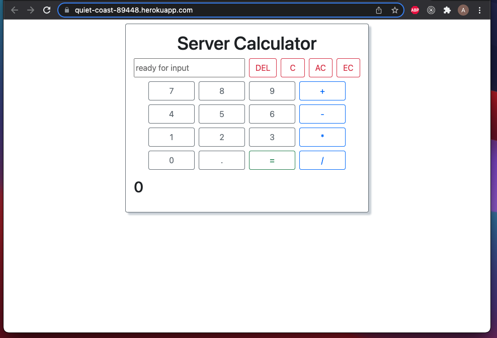
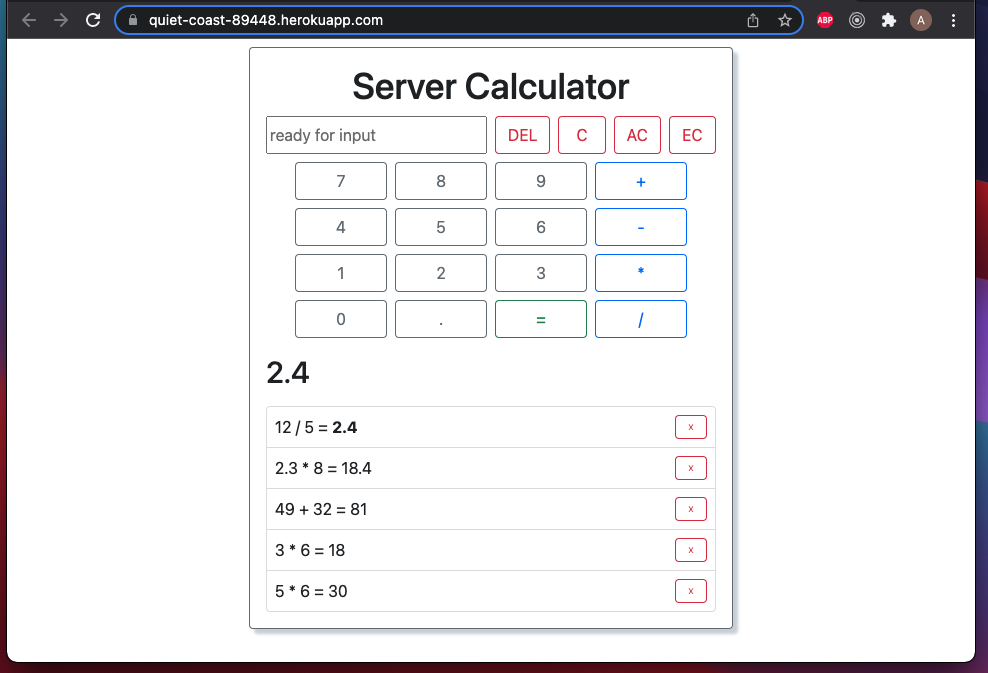

# Project Name

jQuery Server Calculator

## Description

Weekend Challenge #2

This is a simple calculator that calculates single operations. Operations are sent to an Express server running on node.js as a POST request. The server makes the calulation, and then stores the operation object in an array. When the client asks for the data in a GET request, the answer to the most recent operation is displayed along with the history of calculations. These history entries may be clicked to be rerun or deleted via a DELETE request.

The deployed version of the app may be found [here](https://quiet-coast-89448.herokuapp.com/)

## Screenshots

## Built With

- node.js
- Express
- jQuery
